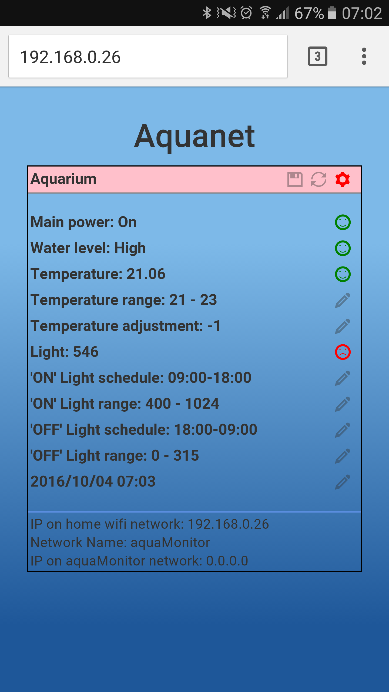
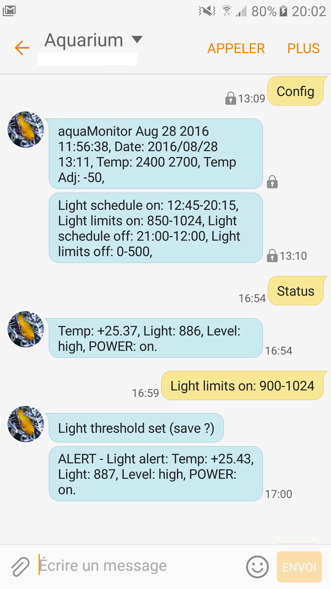
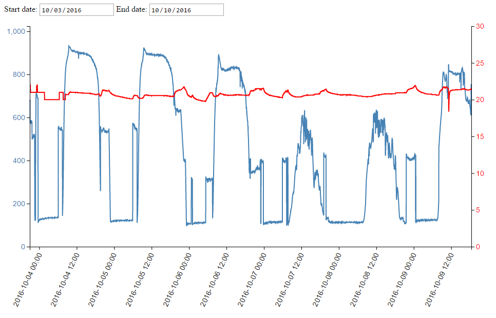
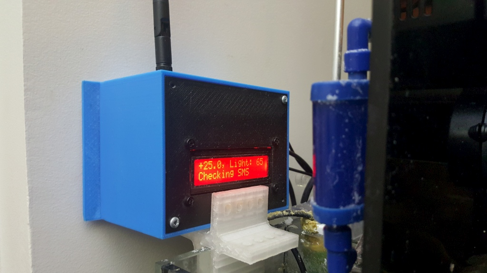
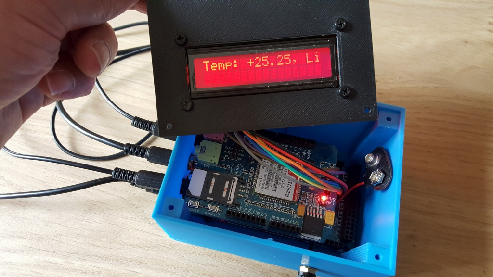
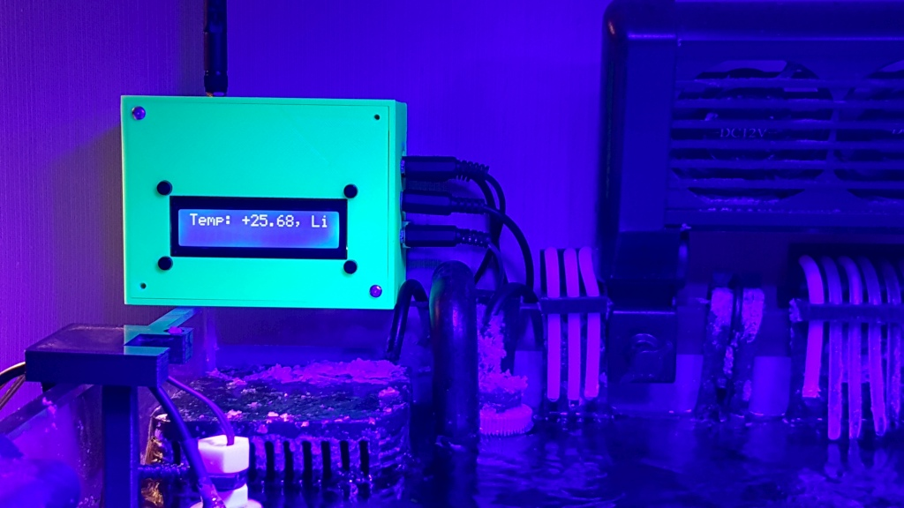

# aquaMonitor

Device to monitor a recifal aquarium (or reef tank) with an Arduino Mega board and send SMS alerts when vitals are bad.

Monitors light level, temperature, water level, main power failure, and sends SMS to all registered mobile phone numbers when configurable thresholds are reached.

Settings (thresholds for light and temperature, light schedule, ...) are all managed through sending SMS, or via a web application.

WebApp showing a light level alert | Example of SMS communication
-------|-------
 | 

Chart displaying evolution of parameters: 

Device installed: 

Although project comes with 3D files to print the <a href="https://github.com/reivaxy/aquaMonitor/blob/master/hardware/bracket/aquaMonitorDemo.stl">triple sensor bracket (light, temperature and adjustable water level sensor)<a> and <a href="https://github.com/reivaxy/aquaMonitor/blob/master/hardware/case/case.stl">case</a>, you dont *need* a 3D printer, you can instead use a case from the market and design your own fixture for the sensors.

A PCB design (for Fritzing http://fritzing.org/home/) is provided, you can either order the PCB, make it yourself, or use a prototyping board instead.

Disclaimer: This system description is provided with no warranty whatsoever. If you use it, you accept to do so at your own risks, should a bug or any event be the cause of a malfunction.
Originally supposed to run on a UNO board, this project does not take full advantage of more advanced Mega board features.

# Available features
* Temperature periodical measurement
* Light periodical measurement
* Water level (high/low) detection
* Main power monitoring
* LCD scrolling display of these measures
* Connects to home wifi network
* Expose a webApp to monitor and set the parameters
* Periodically sends measures to an external website to provide charts
* Sending SMS with light, temperature, main power and water level when thresholds are reached
* Can subscribe/unsubscribe a new phone number to alerts by sending an SMS.
* Adjusting the high/low light threshold and schedules by SMS
* Adjusting the temperature value by SMS
* Adjusting the time interval when light should be on.
* Save and read params (thresholds...) to EEPROM
* Battery in case main power fails.
* Most strings stored in PROGMEM to save variable memory space, easily localizable.
* Each subscribed phone numbers can set a minimum interval between 2 alerts to avoid flooding
* Periodical checking for incoming SMS, handles messages like :
  * 'admin +33xxxxxxxx' : add this phone number with admin rights
  * 'config' : send back the config
  * 'display': Reset the display when messy (prototype contact issue ?, investigating)
  * 'interval xxx' : No more than 1 sms per xxx seconds
  * 'light XXX' : set the low light threshold for alerts
  * 'save': save the configuration (light schedule and level, temp range, subs, admin, ...) to EEPROM
  * 'schedule hh:ss - hh:ss' : set the time span during which light should be above threshold
  * 'status': send SMS back with current measures
  * 'sub reset': resets all subscriptions (admin only)
  * 'sub xxx' : subscribe to a service (alert, event)
  * 'subs' : send back list of subscribed phone numbers (admin only)
  * 'temp XXX YYY': set the low (XXX) and high (YYY) thresholds for temperature
  * 'temp adj XXX': set the temperature adjustment signed value
  * 'time 2016/07/30 11:00' : set the date and time
  * 'unsub xxx' : unsubscribe to a service (alert, event)

  
# TODOs
* Water movement detection to warn about pumps failure (sensor remains to be found or designed...) 
* Some more configuration by SMS (level detection switch state inversion for instance, or display shift frequency ?)
* Periodical status sending (upon registration) ?
* see roadmap for bigger planned changes (Local Access Point for slave devices to connect to)

# More pictures 

Prototype (at the time it could run on a UNO board): 
 

  
Finished: 

Other device installed: 

  
Sensors: 

  

#License

 This work is licensed under a <a rel="license" href="http://creativecommons.org/licenses/by-nc/4.0/">Creative Commons Attribution-NonCommercial 4.0 International License</a>.
