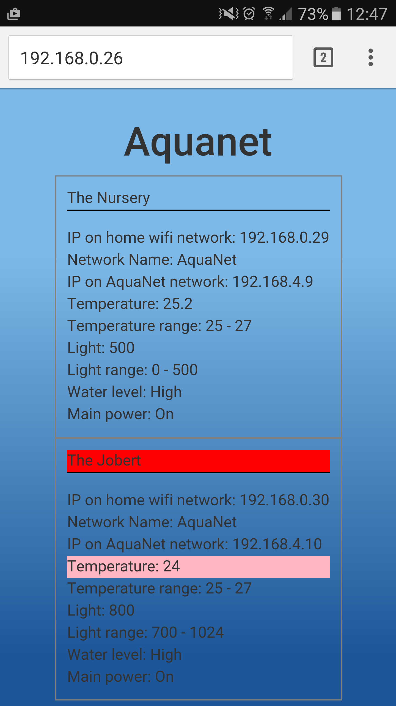

# aquaNet

This is the optional Wifi device that will allow you to:
* Access aquaMonitor through a web interface to modify the settings and run commands
* Have aquaMonitor periodically log measures to an external web site in order to build statistics
* Have several aquaMonitor modules share one GSM (hence one SIM card) to send alerts.

Use the Arduino IDE to build and upload the binary to your ESP8266 module.
The steps to set up the IDE are described here: http://randomnerdtutorials.com/how-to-install-esp8266-board-arduino-ide/

Prototype of the page served by the Master module, displaying the results for itself and a Station module:

