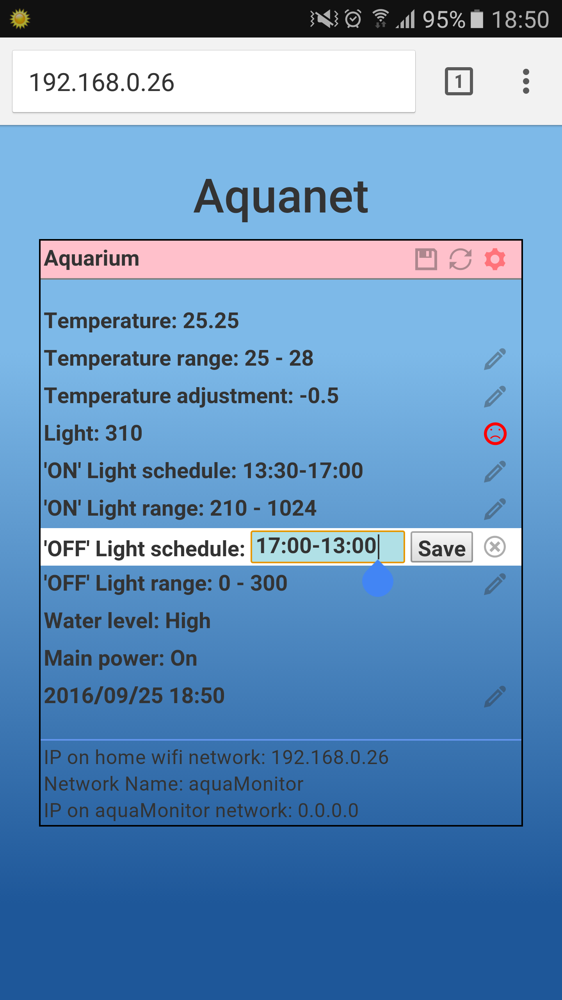

#aquaNet Web application

This directory hosts the main part of the webApp exposed by the ESP8266 wifi module on the wifi local network it creates.

This external hosting makes it easy to modify the webApp with no need to flash the ESP8266, is much more convenient when using images, and provides much better performances.

