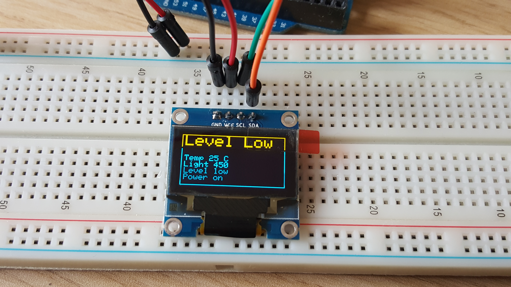

Warning: this project is asleep, while I'm working on iotinator which should replace it with much better modular architecture, smaller and cheaper components, and many more features. The esp8266 version is still a prototype, while the earlier version is fully functional, two devices currently running 24/7 since spring 2015.)

#V1.0 2016/09
- Full config via SMS
- config saved in EEPROM
- monitors water level, light on level and schedule, light off level and schedule, temperature, main power
- send alerts via SMS
- logs info on serial line
- LCD display 2x20 with measures and messages
- battery backup
- extra phone numbers subscription to get alerts

#Planned evolutions

Hardware stuff:
- Investigate replacing LCD screen with Oled screen ?. Ordered for prototyping, here is the look:

 

  Nice thing is low consumption.

- replace the 3 jack sockets with a DB15 socket ? Mechanical issue to fix on the case if wires are soldered. Need connectors :(

#V2.0 (now in master branch)
The software is mostly ready for V2 in master branch. Needs to make more settings accessible, and need schematics update (and new PCB)
- Connects to home wifi network, using ESP8266
 

- Logs all measures to external website
- expose a webApp allowing to see all data, and edit settings

The features below will be implemented in the "iotinator" project (ok sorry but it's hard to come up with a good name).
~~#V3.0
- Creates own private wifi network
- Monitors extra aquaMonitor devices connections. These ones won't have a GSM circuit, only wifi.
- Handles all connected devices to forward them configuration messages, and transmit their alerts by SMS.~~

~~#V4.0
- Any extra device will be able to create its own private wifi network to handle more devices
Would be useful for people owning more than 5 tanks. I know one.
(wifi component only accepts 4 simultaneous connections. Could multiplex, but less fun, and not as quick)~~

